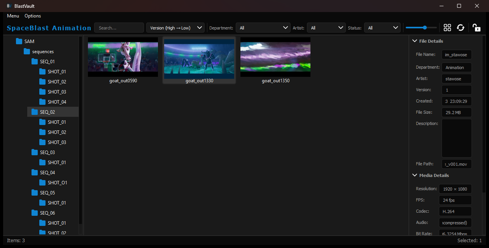
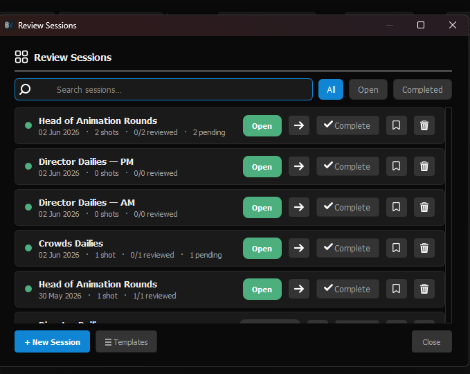
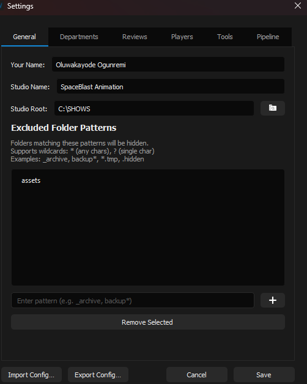

# BlastVault

**BlastVault** is a desktop dailies and review tool built for animation/VFX production pipelines. It gives artists, supervisors, and admins a fast, filterable browser for shot catalogs on a shared studio drive, with built-in versioning, review sessions, notes, and one-click playback in an external player — no plugin or DCC integration required.

Built with **PyQt5**, BlastVault reads directly off the filesystem (plus lightweight `.meta`/`.json` sidecars), so it can be pointed at any existing show folder structure without migrating assets into a database.


---

## Table of Contents

- [Features](#features)
- [Screenshots](#screenshots)
- [How it works](#how-it-works)
- [Installation](#installation)
- [Getting Started](#getting-started)
- [Configuration](#configuration)
- [Multi-User Setup (Artist Registry)](#multi-user-setup-artist-registry)
- [Review Workflow](#review-workflow)
- [Playback (BlastPlayer integration)](#playback-blastplayer-integration)
- [Project Structure](#project-structure)
- [Roadmap ideas](#roadmap-ideas)
- [License](#license)

---

## Features

- **Catalog browser** — Add any number of studio root folders ("catalogs") and browse them as a tree in the left panel; the center panel shows a thumbnail grid or list view of the media inside the selected folder.
- **Sequence-aware versioning** — Folders named `SEQ_*`, `SQ_*`, or `SEQUENCE_*` are treated as shot sequences. BlastVault parses `name_department_artist_v###`-style filenames, groups files into logical assets, and automatically surfaces only the **latest version per department** — with a one-click Version History popup showing every prior version.
- **Video thumbnails & metadata** — Thumbnails for video files are grabbed via `ffmpeg` and cached to disk; full technical metadata (resolution, fps, codec, audio, bit rate, duration, frame count) is read via `ffprobe` and shown in the right-hand details panel without blocking the UI.
- **Status tracking** — Every shot carries a status (`WIP`, `Review`, `Approved`, `Revision`, `On Hold`) shown as a colored badge on its thumbnail, editable from the right panel, with a full timestamped status history.
- **Filtering & sorting** — Live search plus dropdown filters for Department, Artist, and Status; sort by name or version (ascending/descending); adjustable thumbnail size and grid/list toggle.
- **Notes & annotations** — Attach threaded notes to any shot; a notes badge appears on the thumbnail so reviewers can spot commented shots at a glance.
- **Review sessions** — Submit shots into named review sessions (Director Dailies, Supervisor Review, CG Supervisor Review, Final Review, or custom types). Reviewers can approve, request revisions, put a shot on hold, add frame-range annotations, and batch-approve/reject across a session.
- **Version compare** — Side-by-side comparison of two versions of a shot, complete with metadata, reviewer notes, and independent playback controls.
- **Live folder watching** — The catalog view auto-refreshes when files change on disk (filesystem events with a polling fallback), so teams working off the same share always see fresh data.
- **Role-based permissions & PIN lock** — Admin / Reviewer / Basic permission tiers gate status changes, session management, and settings; a PIN-protected lock icon keeps casual users from editing statuses on a shared workstation.
- **External player launching** — Double-click or right-click → *Open with* to play a shot in a companion **BlastPlayer** app, any auto-detected system player, or a custom player you register in Settings. Multi-select and "Play all in BlastPlayer" builds an instant playlist.
- **Studio-wide artist registry (optional)** — Point BlastVault at a shared `artists.json` (local path, network path, or HTTP endpoint) to centrally manage usernames, departments, roles, and the admin PIN across the whole team, with live reload when the registry file changes.
- **Config import/export** — Back up or clone a workstation's BlastVault configuration in one click.

## Screenshots

**Catalog browser** — sequence tree on the left, thumbnail grid in the center, live file metadata (resolution, fps, codec, status) on the right:



**Review Sessions** — track dailies/review rounds per catalog, with per-session shot counts and reviewed/pending status:



**Settings** — configure studio name, catalogs, excluded folder patterns, departments, review types, players, and pipeline integrations:



## How it works

BlastVault does not import or duplicate media — it reads a studio's existing show folder structure in place:

1. You register one or more **catalog** root folders (e.g. `C:\SHOWS\SAM`).
2. Browsing a folder loads its video files (and, inside `SEQ_*` sequence folders, groups them into versioned assets) into a thumbnail grid.
3. Metadata about each shot — artist, department, version, status, notes — is read from a `.meta` sidecar (`<folder>/.meta/<stem>.meta`), falling back to a legacy `.txt` sidecar, and finally to parsing the filename itself if no sidecar exists yet.
4. Review activity is stored as JSON session files under `<catalog_root>/.reviews/`, so review history travels with the show and can be inspected or backed up like any other file.

This makes BlastVault easy to drop into an existing pipeline: nothing needs to be pre-processed, and artists can keep using their normal file/version naming conventions.

## Installation

**Requirements**

- Python 3.8+
- [PyQt5](https://pypi.org/project/PyQt5/)
- [FFmpeg](https://ffmpeg.org/) (`ffmpeg` + `ffprobe`) available on your `PATH`, or installed in a common location — BlastVault auto-detects it and lets you verify the detected path from *Settings → Tools*.

```bash
git clone https://github.com/kaywizzy123/BlastVault.git
cd BlastVault
pip install PyQt5
```

**Run it:**

```bash
python main_ui.py
```

> BlastVault has no CLI arguments — everything is configured from within the app.

## Getting Started

On first launch (when no config file exists yet), BlastVault walks you through a short setup:

1. **Your Name** — used to attribute notes, reviews, and submissions to you.
2. **Studio Name** — shown in the header.
3. **Studio Root Folder** — the top-level folder containing your shows; BlastVault registers it as your first catalog.

After that, use **Menu → Add Catalog** at any time to register additional root folders, and **Options → Settings** to configure departments, artists, review types, custom players, FFmpeg/BlastPlayer paths, and the artist registry.

## Configuration

BlastVault stores its settings in a local `config.json` (next to `main_ui.py` when run from source, or in the OS application-data directory when packaged as an executable). Key settings include:

| Key | Description |
|---|---|
| `catalogs` | List of registered root folders |
| `departments` / `artists` | Dropdown lists used for filtering and metadata tagging |
| `review_types` | Available review session types (e.g. "Director Dailies", "Final Review") |
| `excluded_patterns` | Wildcard patterns for folders to hide from the browser (e.g. `assets`) |
| `custom_players` | Extra external players available from the right-click "Open with" menu |
| `blast_player_path` | Path to a companion BlastPlayer install |
| `registry_path` | Local path or URL to a shared `artists.json` |
| `admin_pin_hash` | SHA-256 hash of the admin PIN used to unlock status editing |

`config.json` and `artists.json` are gitignored by default since they're per-machine/per-studio state — use *Settings → Export Config* to share or back up a configuration deliberately.

## Multi-User Setup (Artist Registry)

For teams, BlastVault can defer identity and permissions to a shared **artist registry** instead of each workstation configuring its own artist list:

- Point *Settings → Pipeline → Artist Registry* at a shared `artists.json` (a network path or an `http(s)://` URL), or set the `BLASTVAULT_REGISTRY` environment variable.
- The registry lists each artist's username, name, department, and **permission level**:
  - **`admin`** — full access: manage settings, sessions, and all statuses; always unlocked.
  - **`reviewer`** — can approve/reject shots and add notes, but can't manage sessions or settings.
  - **`basic`** — can submit shots for review and browse; status editing requires the PIN lock.
- The registry can also centrally override the studio name and admin PIN hash.
- BlastVault watches the registry file for changes and reloads permissions live — no restart needed when an admin updates `artists.json`.
- Without a configured registry, BlastVault falls back to a single-user PIN: the first person to set a PIN becomes the workstation's admin.

## Review Workflow

1. **Submit** — Select one or more shots and choose *Submit for Review* to add them to an open review session, with a priority (`normal`/`high`/`urgent`) and a note. This marks the shot's status as `Review`.
2. **Review** — Open *Menu → Review Sessions…* to manage sessions for the current catalog. Inside a session, reviewers can:
   - Approve, request Revision, or put a shot On Hold, with an optional note.
   - Add frame-range annotations to call out specific frames.
   - Batch-approve or batch-reject via multi-select.
   - Compare the new submission against the previous approved version side-by-side.
3. **Track** — Every status change is recorded with a timestamp in the shot's status history, visible from the right panel, and every prior submission is preserved in the session's version history so nothing is overwritten.
4. **Manage** — Admins can create, complete, reopen, or delete sessions, and maintain a set of reusable session templates.

## Playback (BlastPlayer integration)

BlastVault is designed to pair with a companion player app, **[BlastPlayer](https://github.com/kaywizzy123/BlastPlayer)**, launched as a separate process for each shot (or a full playlist via "Play all in BlastPlayer"). By default BlastVault looks for it as a sibling folder next to BlastVault on disk (or at the path configured in `blast_player_path`); if it isn't found, playback falls back to your OS's default handler for the file, or to any custom player you've registered in Settings.

## Project Structure

```
BlastVault/
├── main_ui.py              # Application entry point / main window
├── config.json              # Per-machine settings (gitignored)
├── core/                    # Non-UI logic
│   ├── constants.py         #   Global state, extensions, status options, path resolution
│   ├── config.py             #   Load/save config.json
│   ├── artist_registry.py    #   Multi-user permission registry
│   ├── probe.py               #   ffprobe wrapper for video metadata
│   ├── meta.py                #   .meta sidecar read/write, filename parsing
│   ├── notes.py                #   Per-asset notes storage
│   ├── reviews.py              #   Review session storage & lookup
│   └── styles.py                #   Qt stylesheet
├── widgets/                  # Main window panels
│   ├── left_panel.py           #   Catalog/folder tree
│   ├── center_panel.py          #   Thumbnail/list grid, filtering, sequences
│   ├── right_panel.py            #   Metadata, status, notes
│   ├── header_widget.py           #   Search, filters, view controls
│   ├── footer_widget.py            #   Status bar
│   ├── thumbnail_loader.py         #   ffmpeg-based video thumbnail generation
│   └── splash_screen.py             #   Startup splash
├── dialogs/                   # Modal dialogs
│   ├── settings_dialog.py         #   General/Departments/Reviews/Players/Tools/Pipeline
│   ├── review_manager_dialog.py     #   Review session list & management
│   ├── review_session_dialog.py      #   Per-session review UI
│   ├── submit_review_dialog.py        #   Submit shots to a session
│   ├── compare_dialog.py               #   Side-by-side version compare
│   ├── notes_dialog.py                  #   Notes thread
│   ├── pin_dialog.py                     #   PIN setup/unlock
│   ├── first_run_dialog.py                #   Onboarding
│   └── add_catalog_dialog.py / remove_catalog_dialog.py
├── utils/                      # Icon loading, cache pruning, small UI helpers
└── icons/                       # Application icons and logo
```

## Roadmap ideas

- Packaged installers (PyInstaller builds for Windows/macOS/Linux)
- In-app large media preview (currently deferred to BlastPlayer)
- Automated tests

## License

No license has been chosen yet for this project. Add a `LICENSE` file to specify the terms under which others may use this code.
